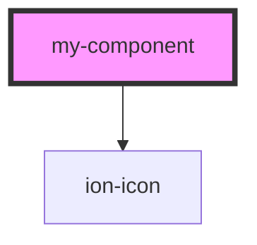

# my-component

<!-- Auto Generated Below -->

## Properties

| Property   | Attribute  | Description                                                                                                                                                                                                                                                            | Type     | Default     |
| ---------- | ---------- | ---------------------------------------------------------------------------------------------------------------------------------------------------------------------------------------------------------------------------------------------------------------------- | -------- | ----------- |
| `color`    | `color`    | The color to use from your application's color palette. Default options are: `"primary"`, `"secondary"`, `"tertiary"`, `"success"`, `"warning"`, `"danger"`, `"light"`, `"medium"`, and `"dark"`. For more information on colors, see [theming](/docs/theming/basics). | `string` | `undefined` |
| `debounce` | `debounce` | How long, in milliseconds, to wait to trigger the `ionChange` event after each change in the range value. This also impacts form bindings such as `ngModel` or `v-model`.                                                                                              | `number` | `10`        |
| `icon`     | `icon`     |                                                                                                                                                                                                                                                                        | `string` | `"heart"`   |
| `max`      | `max`      | Maximum integer value of the range.                                                                                                                                                                                                                                    | `number` | `100`       |
| `min`      | `min`      | Minimum integer value of the range.                                                                                                                                                                                                                                    | `number` | `0`         |
| `value`    | `value`    | Value                                                                                                                                                                                                                                                                  | `number` | `0`         |

## Events

| Event       | Description                                  | Type                                  |
| ----------- | -------------------------------------------- | ------------------------------------- |
| `junChange` | Emitted when the value property has changed. | `CustomEvent<RangeChangeEventDetail>` |

## Dependencies

### Depends on

- ion-icon

### Graph

----------------------------------------------

*Built with [StencilJS](https://stenciljs.com/)*
